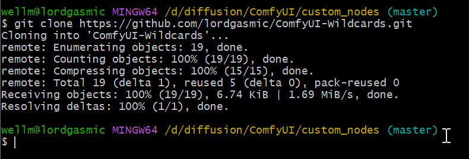
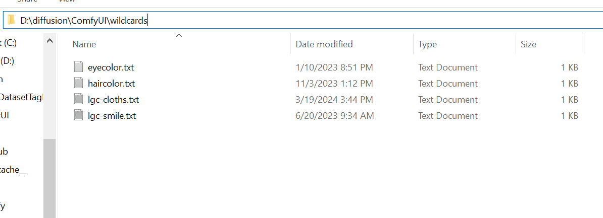
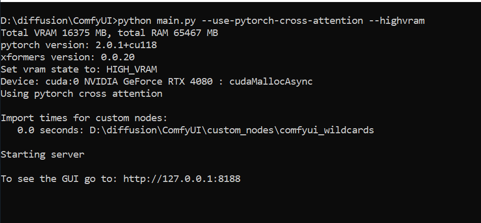
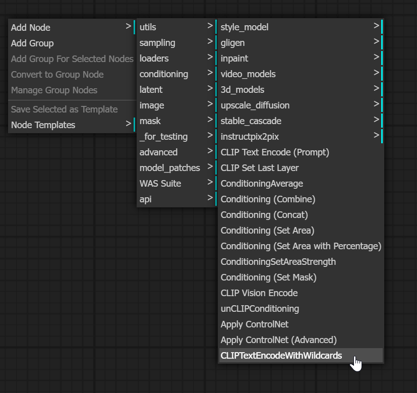
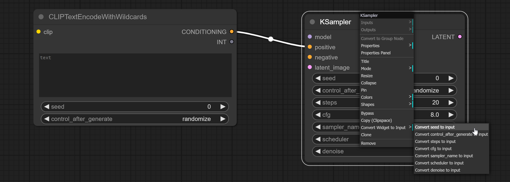
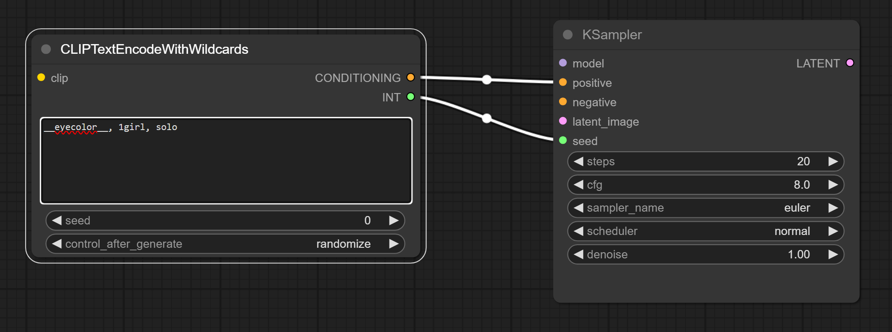

# comfyui_wildcards

This is an attempt to recreate the wildcards plugin for Automatic1111 but for ComfyUI.

## Installation Instructions
1. Clone this repository into your custom_nodes directory (eg. /path/to/ComfyUI/custom_nodes)
1. Create a directory in the root of your ComfyUI install called "wildcards" (eg. /path/to/ComfyUI/wildcards)
1. Add .txt files with the various wildcards ([check here for examples](https://github.com/lordgasmic/comfyui_wildcards/tree/7834d95bbd372e849b5e47c7b45103dc8d732603/examples)) todo add link
1. Restart your ComfyUI application
1. You should see that the custom node has been loaded successfully

## Usage Instructions
1. In ComfyUI add the new wildcards node by doing one of the following:
   - right click > Add Node > conditioning > CLIPTextEncodeWithWildcards
   - double click > add search text for "wildcards" > CLIPTextEncodeWithWildcards
1. Activate wildcards by adding the filename surrounded by double underscores to the prompt (eg. \_\_eyecolor__)
1. You can use multiple wildcards if you choose (eg. \_\_eyecolor__, \_\_smile__)
1. Wire the node up

## Optional Instructions
The wildcard node can generate its own seed.  This is useful if you want to recreate something over and over again with the same seed and the same wildcard options.  If you wish to use this seed with the rest of your prompts/samplers you can redirect its INT output into the seed input

## Instalation Screenshots

## Usage Screenshots

## Known Issues
- unlike the A1111 version, the wildcard that was picked does not get replaced in the png info
